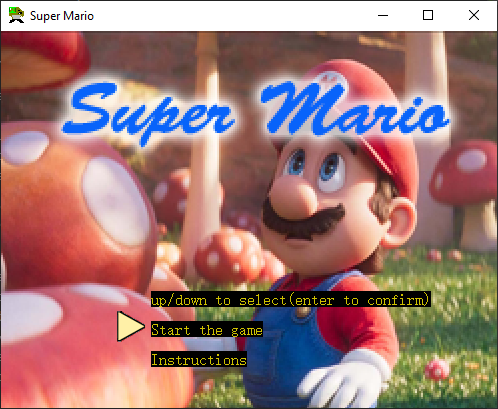
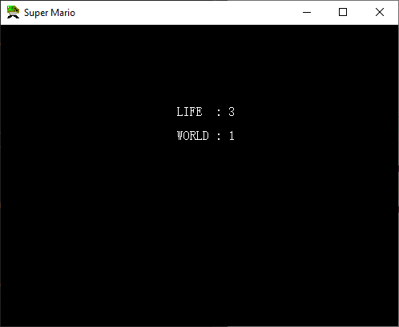
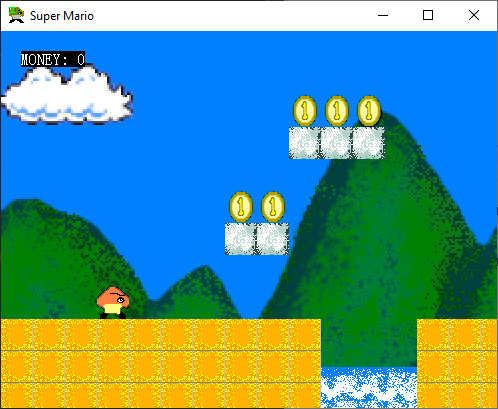
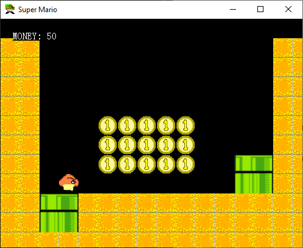

# Super Mario

An attempt to translate the original Super Mario Bros. for the NES to readable C/C++. Developed using Visual Studio 2017, Photoshop, and Brush. These are simple yet sufficient development tools.

## Operation

- Jump: X
- Bullet: Z
- Move: Arrow key
- Reset window: W

## Code Description

The game code is divided into two parts: the image part and the logic part. Let me talk about the image part first: there are two types of images, rectangular pictures, and irregular pictures.

Rectangular images are:
- Ground
- Bricks
- Water pipes
- Blood bars
- Blood bar background

Irregular pictures are:
- Mushroom (player, enemy 1, enemy 2)
- Bullet
- Whirlwind
- Explosion effect
- Gold coin
- Score after hitting the gold coin
- Attack weapon (that stuff picked from Contra)
- Fire circle 1
- Fire circle 2
- Arrows (for start menu selection)
- Trees
- Rivers
- WIN logo
- Background images (game background and menu background)

In a side-scrolling game or a shooting game, there is a background image, such as mountains, sky, clouds, starry sky, etc. These pictures are generally only 1 to 2 times the width of the screen, and then move in circles like a scroll, and they are connected into one piece, which feels like a very long picture. This class is designed to handle this background. In the enhanced version of Super Mario, there are 3 main levels, each with a background picture; entering from the water pipe, there are two levels, all with a black picture. There are four pictures in total. The four images are of the same size and arranged vertically in a bitmap file. The class MYBKSKY is derived from MYBITMAP. Since the background image only needs to complete the effect of circular movement, only one function needs to be implemented, and there is no need to care about any other issues (such as handles, dc). It's simple to code, again reflecting object-oriented benefits.

### Technical Principle

To create a scrolling effect for the background image, a simple approach is used. Imagine a vertical dividing line that splits the picture into left and right parts. The right part is displayed first, and then the left part is attached to the end of the picture. By continuously moving the dividing line to the right, the picture is displayed cyclically.

Game pictures are divided into three categories: map items, map background objects, and sprites (irregular pictures).

When engaging in battles with monsters, a blood bar should be displayed at the top of the screen.

Background objects include grass, rivers, trees, and destination signs. These objects are only displayed on the screen and do not involve any logic processing. The pictures are stored in a bitmap file and have irregular shapes.

Sprites include:

- Mushrooms (player, enemy 1, enemy 2)
- Bullets
- Whirlwinds
- Explosion effects
- Gold coins
- Points after hitting gold coins
- Attack weapons (from Contra)
- Fire circles 1
- Fire circles 2
- Arrows (for start menu selection)
- Players have two attack methods: normal attack (bullet) and magic attack (whirlwind).

In the game, time is life. The game program performs two main tasks: displaying pictures and processing logic. A timer is set to periodically send a WM_TIMER message. During the processing of this message, logic is processed first. After the logic processing is completed, the WM_PAINT message is sent using the InvalidateRect function to display various pictures. The game continues to run until the program ends.

### Map and Movement

Super Mario's map can be seen as a two-dimensional grid, where each grid is 32x32 pixels in size. The game window is 12 tiles high and 16 tiles wide. The width of the game map is 5 times that of the game window, which means it is 12 grids high and 5x16 grids wide.

Map items include ground, bricks, and water pipes.

Background items are simpler, including grass, trees, rivers, and win signs. These background items only need to be displayed and do not involve logic processing.

To display everything in the window and move with the player, the concept of a "view" is used. The view represents the area visible to the player and is a window with a height of 12 blocks and a width of 16 blocks (each block is 32x32 pixels). The entire map is initially drawn on a DC (device context), and then the image of the current view area is captured from this map DC and drawn into the window. By modifying the coordinates of the view area (increasing the abscissa), the movement of the map is realized.

There are two types of maps: ordinary maps and hidden maps (accessed through water pipes). Before entering each level, all game data needs to be initialized. The same applies to entering hidden maps. Additionally, when returning to the upper map from a hidden map, the player must appear at the "outlet pipe." It is crucial to set the map data, player data, and view data correctly.

The player controlled by the player character class is similar to various mobs (monsters). It involves keyboard response, motion control, and picture display.

Player movement is divided into walking and jumping states, each with different variables representing the horizontal and vertical speeds. The direction of movement is determined by the idirect attribute.

The player's movement is controlled as follows:

When a player presses a key, the corresponding properties are set. Releasing the key clears the action attributes.
A function continuously checks these variables and controls the player's movement accordingly.
When the player enters or exits a water pipe, animations are played for entering and rising from the water pipe. Once the animation finishes, the game switches to the new map. During animation playback, keyboard response is disabled, and the player cannot control the movement.

This README.md provides an overview of the Super Mario project, its code structure, technical principles, and gameplay mechanics.

## License

This project is licensed under the [MIT License](LICENSE). Feel free to modify and distribute the game as per the terms of the license.
